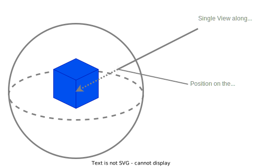
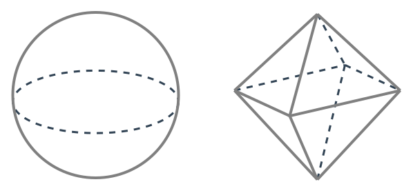
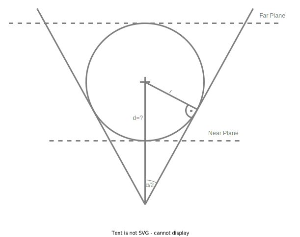

# Pixel Contribution
Small research project for determining the pixel contribution of a geometry from all views.

## Getting Started

### Build
In order to build the debug-version run
```bash
cargo build
```
and
```bash
cargo build --release
```
for the release build.
The resulting artefact is then either in `./target/debug/pixel-contribution` or `./target/release/pixel-contribution`, respectively.

### Run
The program has the mandatory parameter `-i, --input-file`. The parameter expects a path to a 3D/CAD-file that is supported by the library `https://crates.io/crates/cad_import` and is the 3D-data that is being used for the pixel contribution calculation.
For more information execute the `--help` option.

## Concepts
The idea is to calculate the pixel contribution of a geometry from all views. The pixel contribution is the number of pixels that are covered by the geometry in a view. The space of all possible views around a point in space for a fixed distance, can be represented as a sphere. Each point on the surface of the sphere represents a view with a certain pixel contribution.
This concept is in the following figure illustrated:



### Encoding the positions on the sphere
In order to encode the positions on the sphere, we use octahedron encoding. An octahedron is a sphere defined by the 1-norm.
See the following illustration for a comparison between the euclidean sphere and the octahedron sphere:



The euclidean sphere sphere is defined by all vectors having the length $1$ w.r.t the euclidean norm. That is:

$$ \{ v:=(x,y,z) \in \mathbb{R}^3 : ||v||_2 := \sqrt{x^2 + y^2 + z^2} = 1 \} $$

Likewise, the octahedron sphere is defined by all vectors having the length $1$ w.r.t the 1-norm. That is:

$$ \{ v:=(x,y,z) \in \mathbb{R}^3 : ||v||_1 := |x| + |y| + |z| = 1 \} $$

In order to map from the euclidean sphere to the octahedron sphere, we only have to normalize the vector w.r.t the 1-norm. The inverse mapping is also quite simple. We only have to normalize the vector w.r.t the euclidean norm.

#### Mapping from octahedron to $[0,1]^2$
The reason why we use the octahedron sphere is, that we can easily map the points on the sphere to the unit square $[0,1]^2$. The mapping is illustrated in the following figure:


We can map the upper hemisphere by simply throwing the z-coordinate away and mapping the resulting coordinates from $[-1,1]$ to $[0,1]$:

$$(x,y,z) \mapsto \frac{1}{2} \cdot (x + 1, y + 1)$$

The lower hemisphere is mapped likewise, but the resulting 2D-coordinates are mirrored s.t. they are mapped into the corner of the unit square. 


### Fitting the camera to the scene
We approximately determine an bounding sphere for the overall scene defined by its center and radius. In order to configure the camera matrices, the first important question is, which distance should the camera have from the scene center to optimally fill the screen without clipping.

#### Finding the optimal distance
The optimal distance is the distance, where the bounding touches the frustum of the camera tangentially. Drawing a line from the touching point to the camera center, we get a line that is orthogonal to the frustum plane as illustrated in the following figure:



We need to determine d, i.e., the distance between the camera center and the center of the bounding sphere.
We assume, we've got a fixed field of view $\alpha \in ]0,2 * \pi[$ and the radius of the bounding sphere $r$ is also known. Using the law of sines we got:

$$\sin\left(\frac{\alpha}{2} \right) = \frac{r}{d}$$

and thus:

$$d = \frac{r}{\sin\left(\frac{\alpha}{2} \right)}$$

The near and far plane of the camera are then defined as:

$$n = d - r \text{ and } f = d + r$$

### Determining the bounding sphere
Determining the perfect bounding sphere is quite expensive. Therefore, we approximate the bounding sphere by using the bounding box of the scene. The bounding box is determined by the minimum and maximum coordinates of all vertices of the scene. The center of the bounding box is then the center of the bounding sphere. The radius of the bounding sphere is the distance between the center and the farthest vertex of the scene.